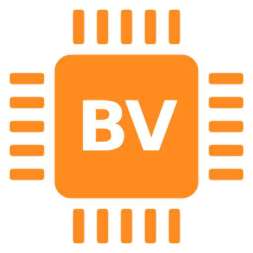

<p align="center"></p>

<h1 align="center">BoardV</h1>

<p align="center">Просмотр плат Altium на ПК и телефоне: открываете <code>.PcbDoc</code> — и сразу видите детали, цепи, номиналы и BOM.</p>

<p align="center">
  <a href="https://github.com/Carn1son/BoardV/releases/latest/download/BoardV.apk"><b>Android (APK)</b></a> ·
  <a href="https://github.com/Carn1son/BoardV/releases/latest/download/BoardV-Setup.exe"><b>Windows — установщик</b></a> ·
  <a href="https://github.com/Carn1son/BoardV/releases/latest/download/BoardV-portable.exe"><b>Windows — без установки</b></a>
</p>

## Что умеет
- Открывает **Altium .PcbDoc** напрямую, а также boardview `.brd` (Test_Link, в том числе зашифрованные, и BRD2), `.bdv`, `.bvr`, `.asc`, `.cad` (GenCAD и ###Panel), `.cst`, Eagle `.brd`, KiCad `.kicad_pcb` и `.zip`.
- Поиск по деталям, цепям и номиналам; клик по пину подсвечивает всю цепь, питание и земля окрашены отдельно.
- **BOM** справа: клик по позиции показывает все места установки, сверху и снизу платы.
- Верх / низ / обе стороны, поворот, зеркалирование нижней стороны.
- Темы, режимы **День / Ночь**, настройка цветов, подписей и выделения, свои цвета цепей.
- Горячие клавиши работают в любой раскладке и переназначаются в настройках.
- Настройки выгружаются в файл и загружаются на другом устройстве.
- Приложения сами проверяют обновления и ставят их после подтверждения.

## Установка
- **Android:** скачайте `BoardV.apk`, откройте и разрешите установку. Следующие версии ставятся поверх, из самого приложения: *Настройки → Обновления*.
- **Windows:** `BoardV-Setup.exe` — обычная установка, `.PcbDoc` открываются двойным кликом, обновления из программы. `BoardV-portable.exe` — запуск без установки.
  Windows может показать «Неизвестный издатель» — *Подробнее → Выполнить в любом случае* (программа не подписана платным сертификатом).

## Сборка
Каждый push в `main` собирает APK и `.exe` в GitHub Actions и публикует их в [Releases](https://github.com/Carn1son/BoardV/releases).

```
src/        исходники вьювера (viewer-ui.html, core.js, pcbdoc.js) и сборка build_apps.py
www/        готовое веб-приложение, которое показывают обе обёртки
android/    обёртка WebView (Java): выбор файлов, сохранение настроек, установка обновлений
electron/   обёртка для Windows: открытие плат двойным кликом, обновления
```
